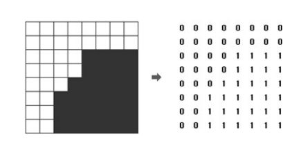

### 중간과제

흑백 영상을 압축하여 표현하는 데이터 구조로 쿼드 트리(Quad Tree)라는 방법이
있다. 하얀색(White) 점을 나타내는 0과 검은색(Black) 점을 나타내는 1로 이루어진 영상(=
2차원 배열)에서 같은 숫자의 점들이 모여 있으면 이를 압축하여 간단히 표현할 수 있다. 즉,
주어진 영상이 모두 0으로만 되어 있으면 압축 결과는 "0"이 되고, 모두 1로만 되어 있으면
압축 결과는 "1"이 되는데, 만약 0과 1이 섞여 있으면 전체를 한 번에 나타내지 못하고 4개의
영상으로 나누어 (왼쪽 위, 오른쪽 위, 왼쪽 아래, 오른쪽 아래) 압축하게 된다. 이때 4개의
영역을 압축한 결과를 차례대로 괄호 안에 묶어서 표현하는 방법을 Quad Tree 알고리즘이라
한다. 
 

 
예를 들어, 위 그림에서 왼쪽의 영상은 오른쪽의 배열과 같이 숫자로 주어지며 이 영상을
Quad Tree 구조를 이용하여 압축하면 (0(0011)(0(0111)01)1)로 표현된다. N×N 크기의 영상이
주어질 때, 이 영상을 압축한 결과를 출력하는 SIC/XE 어셈블리 코드를 작성하시오. 
 
 

### 입력 조건
첫째 줄에는 영상의 크기를 나타내는 숫자 N 이 주어진다. N 은 언제나 2의
제곱수로 주어지며, 1 ≤ N ≤ 8의 범위를 가진다. 두 번째 줄부터는 길이 N의 문자열이 N개
들어온다. 각 문자열은 0 또는 1의 숫자로 이루어져 있으며 영상의 각 점들을 의미한다. 